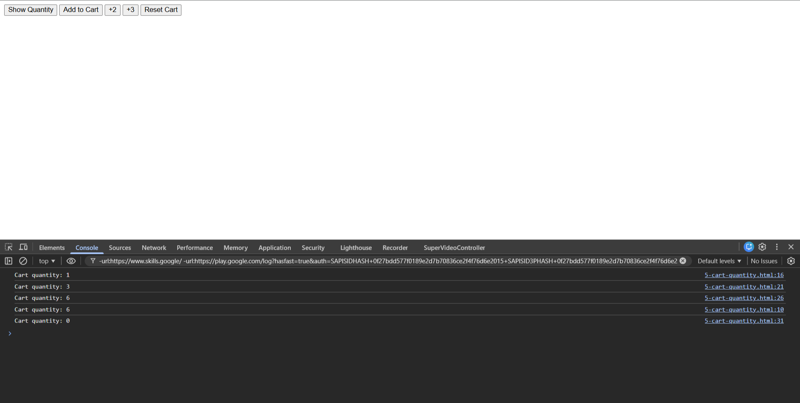
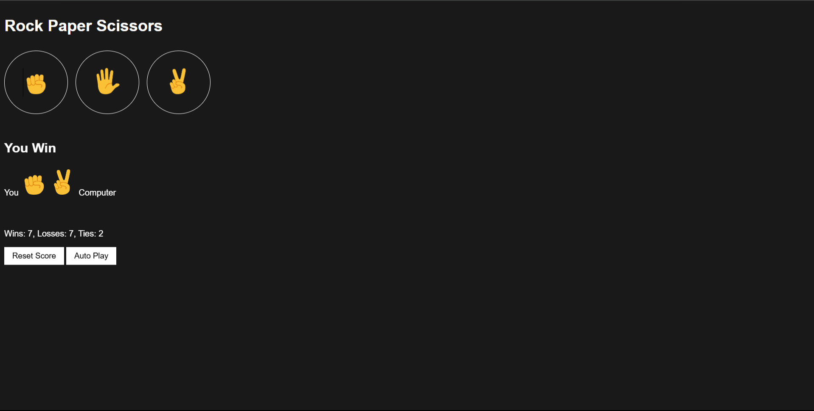
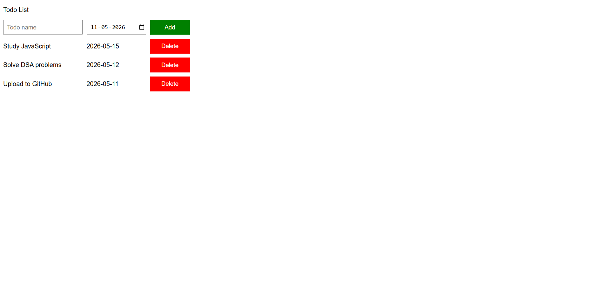

# 🧠 JavaScript Mini Projects

A collection of small JavaScript projects built while learning JS from scratch.  
Each project focuses on a specific concept — variables, DOM manipulation, events, localStorage, and more.

---

## 🚀 Live Demos

| Project | Live Link |
|---|---|
| Cart Quantity | [▶ View Live](https://anantagarwal1307.github.io/JavaScript-Mini-Projects/cart-quantity.html) |
| Rock Paper Scissors | [▶ View Live](https://anantagarwal1307.github.io/JavaScript-Mini-Projects/rock-paper-scissors.html) |
| DOM Projects | [▶ View Live](https://anantagarwal1307.github.io/JavaScript-Mini-Projects/dom-projects.html) |
| Todo List | [▶ View Live](https://anantagarwal1307.github.io/JavaScript-Mini-Projects/todo-list.html) |

---

## 📸 Screenshots

### 🛒 Cart Quantity


### ✂️ Rock Paper Scissors


### 📺 DOM Projects


### ✅ Todo List


---

## 🛠️ Built With

- HTML5
- CSS3
- JavaScript (Vanilla)
  - DOM Manipulation
  - Events & Functions
  - localStorage
  - setInterval

---

## 📁 Project Structure

```
JavaScript-Mini-Projects/
│
├── cart-quantity.html          # Cart counter using variables
├── rock-paper-scissors.html    # Full RPS game with score saving
├── dom-projects.html           # Subscribe button + shipping calculator
├── todo-list.html              # Todo list with due dates
│
├── screenshots/                # Screenshots of each project
│   ├── cart-quantity.png
│   ├── rock-paper-scissors.png
│   ├── dom-projects.png
│   └── todo-list.png
│
├── styles/
│   ├── rock-paper-scissors.css
│   └── todo-list.css
│
├── scripts/
│   ├── rock-paper-scissors.js
│   └── todo-list.js
│
├── images/
│   ├── Rock-emoji.png
│   ├── Paper-emoji.png
│   └── Scissors-emoji.png
│
├── .gitignore
├── LICENSE
└── README.md
```

---

## 📚 Projects Overview

| Project | Concepts Covered | File |
|---|---|---|
| Cart Quantity | Variables, `let`, template literals, onclick | `cart-quantity.html` |
| Rock Paper Scissors | Functions, objects, `localStorage`, `setInterval` | `rock-paper-scissors.html` |
| DOM Projects | `querySelector`, `classList`, `innerHTML`, keyboard events | `dom-projects.html` |
| Todo List | Dynamic DOM rendering, date input, external JS | `todo-list.html` |

---

## 🎯 What I Learned

- JavaScript variables (`let`, `const`) and data types
- Template literals (`` `Hello ${name}` ``)
- Writing and calling functions
- DOM manipulation with `querySelector`, `innerHTML`, `classList`
- Handling keyboard events with `onkeydown` and `event.key`
- Saving data with `localStorage` so it persists after page refresh
- Auto-repeating logic with `setInterval`

---

## 🙈 .gitignore

This project uses a `.gitignore` file to avoid pushing unnecessary files to GitHub.  
It ignores OS files (`.DS_Store`, `Thumbs.db`), editor files (`.vscode/`, `.idea/`), and Node.js files (`node_modules/`).

---

## 👤 Author

**Anant Kumar Agarwal**  
B.Tech CSE | Roorkee Institute of Technology  
[GitHub](https://github.com/anantagarwal1307)

---

## 📄 License

This project is licensed under the [MIT License](LICENSE).
